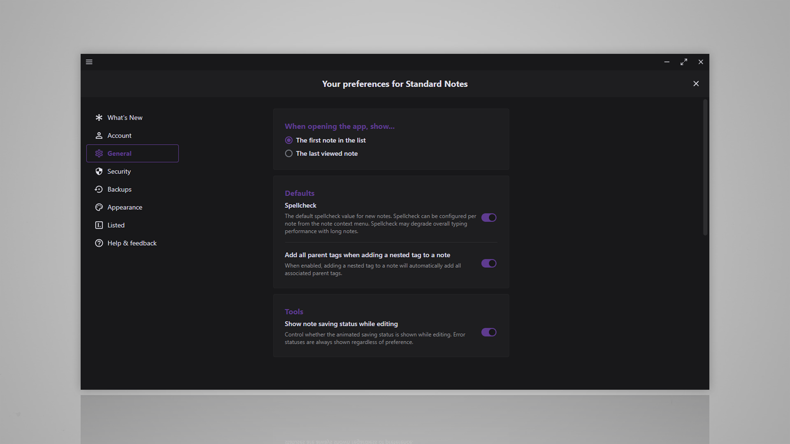

# Standard Notes Dark Matter theme
A modern dark theme for [Standard Notes](https://standardnotes.com/)
> [!NOTE]
> Editor that are part of the paid subscription are NOT supported due to me not having spare cash to buy it :).

## Installation
**Installation Link**: `https://listed.to/p/Gky1d63Dyp`

1. Open the preferences menu

2. General > Advanced options

3. Scroll down and paste the installation link in the `Install External Plugin` field

4. Click `Install`
