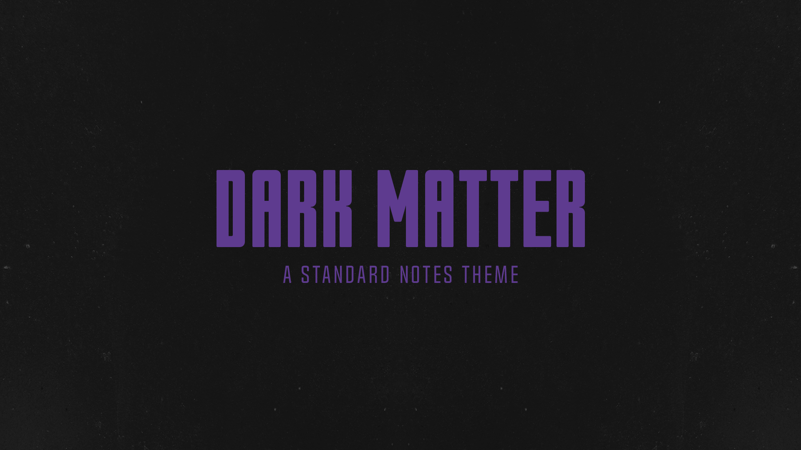

# Dark Matter theme for Standard Notes
> A modern dark theme for [Standard Notes](https://standardnotes.com/)

## Installation
**Installation Link**: `https://raw.githubusercontent.com/MaxTaraev/standard-notes-dark-matter-theme/new-main.css/extension.json`

1. Open preferences menu

2. General > Advanced options

3. Scroll down and paste the installation link in the `Install External Plugin` field

4. Click `Install`
