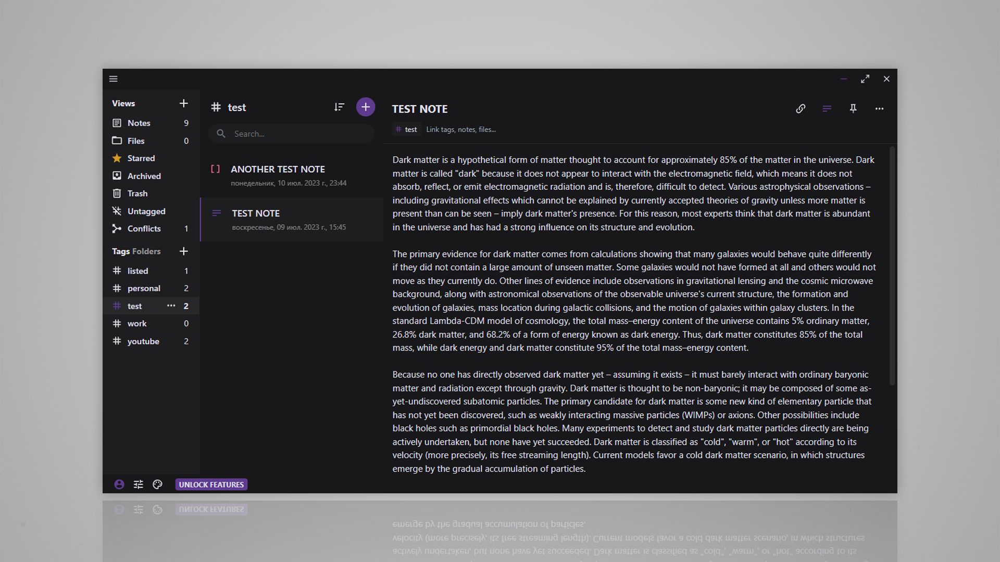

# Standard Notes Dark Matter theme
> [!IMPORTANT]
> Editors that are part of the paid subscription are **NOT SUPPORTED** due to me not having spare cash to buy it :)
> If would like to contribute and cover the paid features - feel free to create a pull request.

## Installation
**Installation Link**: `https://listed.to/p/Gky1d63Dyp`

1. Open the preferences menu

2. General > Advanced options

3. Scroll down and paste the installation link in the `Install External Plugin` field

4. Click `Install`
